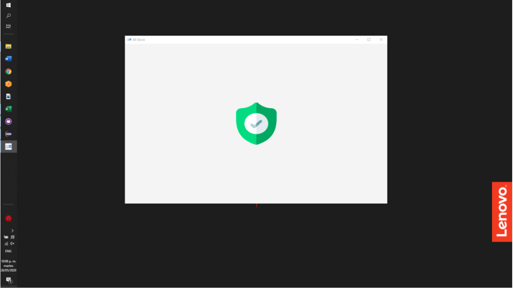
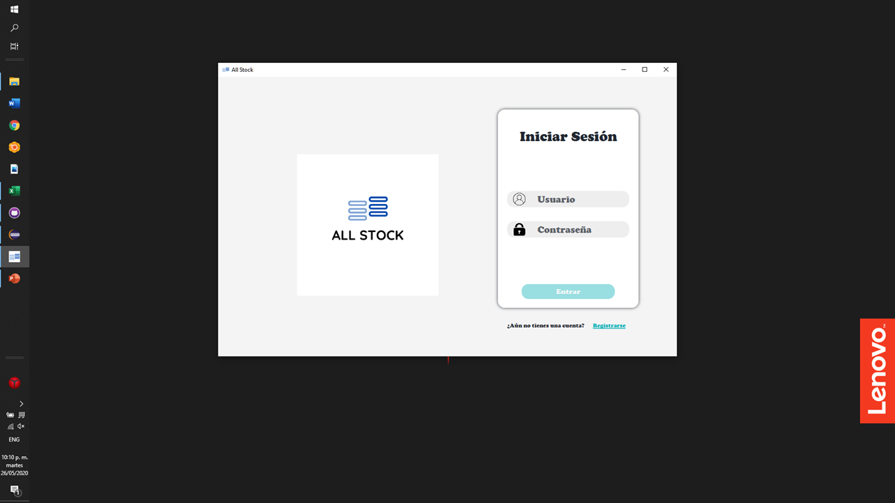
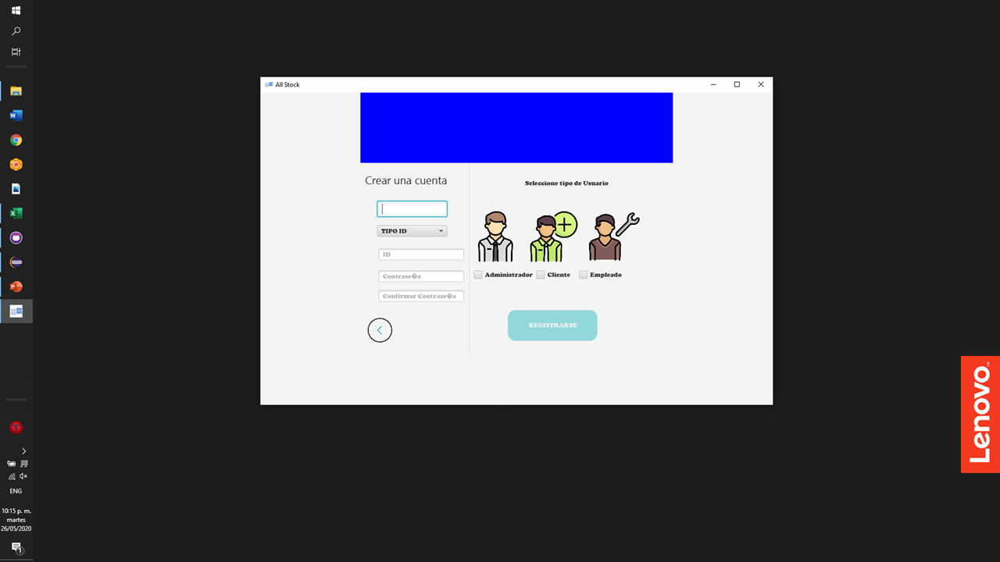
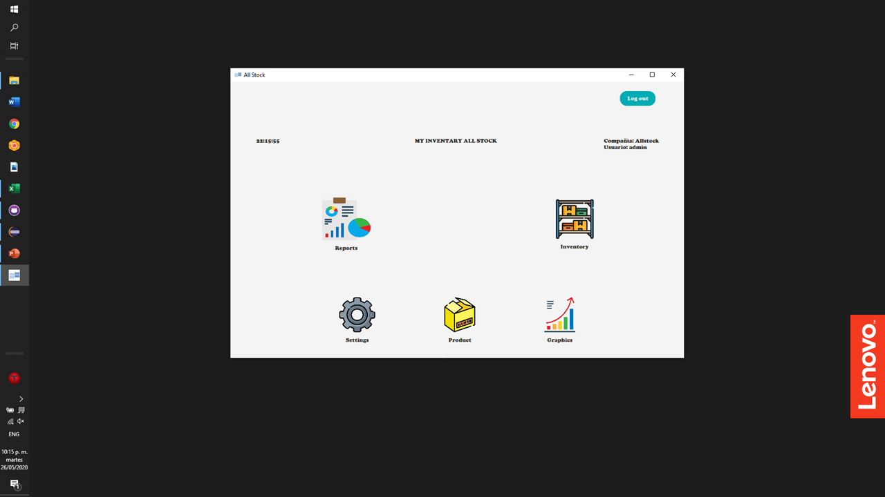
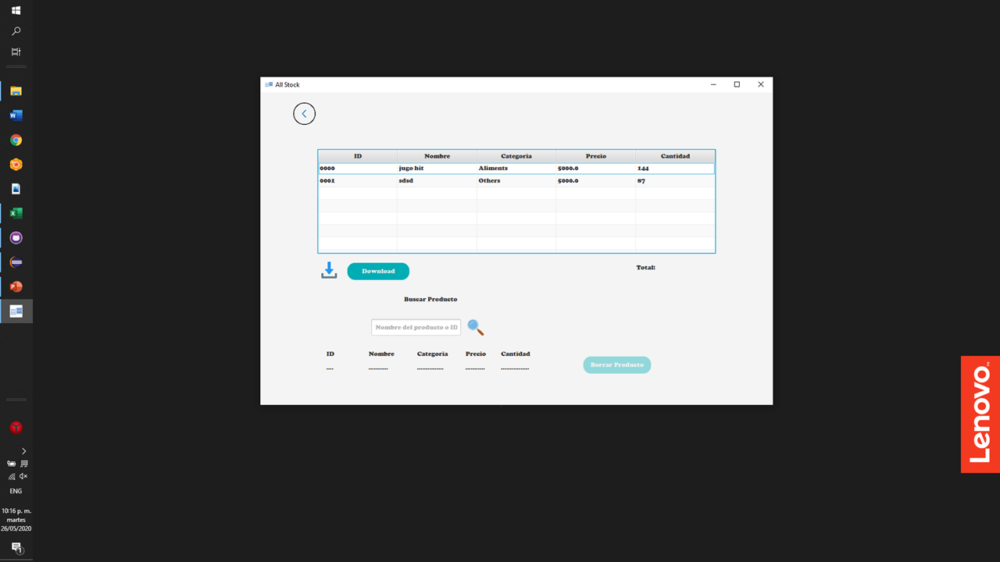
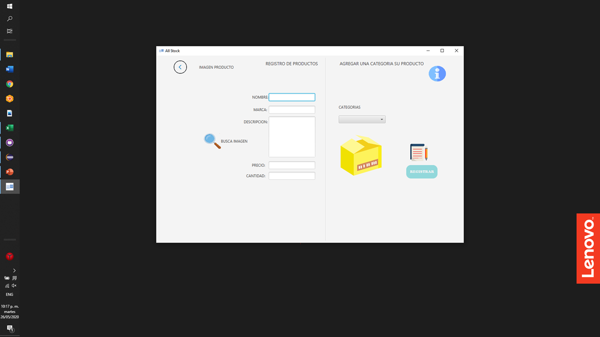
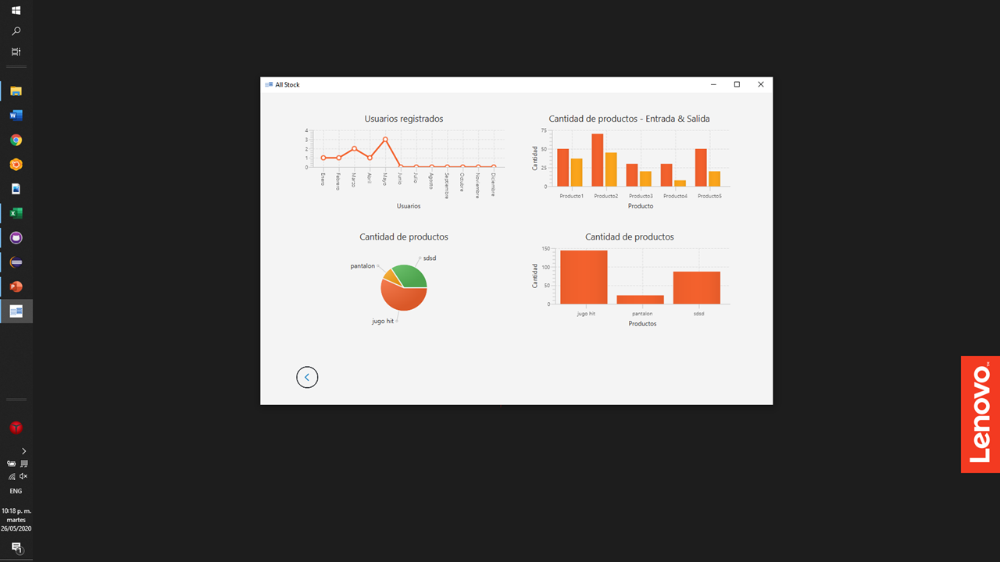
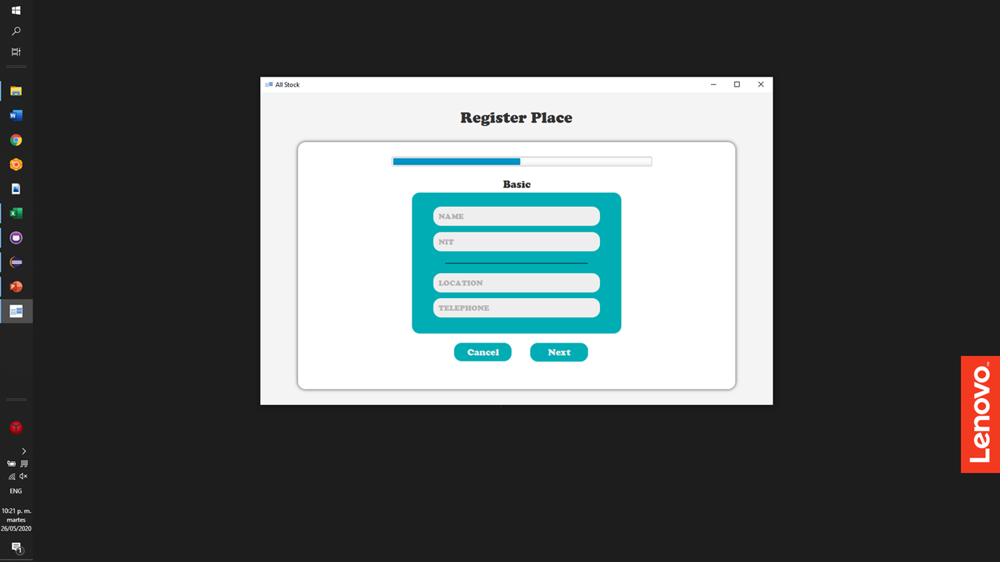

# All_Stock

##  Inventario personalizado para productos
### El repositorio contiene un proyecto de inventario desarrollado en el lenguaje de programacion java. 
## QUE ES?
### All Stock es un aplicacion de inventario, el cual permite agregar tu tienda, en ella unos usuarios para el control del inventario de  tu empresa, ademas de los productos donde estos los puedes organizar por categorias , llevando asi un orden mas facil, el programa cuenta con reportes de texto, donde te muestra la totalidad de productos en el inventario, el analisis de registros en tu empresa, el porcentaje de la cantidad de productos, y demas funciones que puedes visualizar en AllStock.

## Otros

### El proyecto fue realizado en el curso de algortimos 2 de la universidad icesi Cali, cuenta con la implementacion de arboles binarios, listas entre otras estrcuturas de datos, ademas de utilizar una interfaz diseñada en SceneBuilder y programada mediante javaFx.

# Analisis
Documento de la fase de analisis del proyecto.
https://github.com/YoNoSoySantiago/All_Stock/blob/master/data/Proyecto%20apo2.pdf

# Diseño
Documento de la fase de diseño del proyecto.
https://github.com/YoNoSoySantiago/All_Stock/blob/master/data/Dise%C3%B1o%20de%20casos%20de%20prueba.pdf

# Diagrama de clases
https://github.com/YoNoSoySantiago/All_Stock/blob/master/data/AllStockDiagram.png

# Link Video

# Visualizacion 
## Ventana de inicio

## Ventana de logeo

## Ventana de registrar Usuario

## Ventana menu inicio

## Visualizacion de inventario

## Ventana de registrar producto

## Ventana de graficas estadisticas

## Ventana de registrar Empresa

## Prueba All Stock.
### USER DEFAULT
### id: admin
### pasword: admin

# Desarrolladores
Santiago Hurtado
Diego Pachon
Sebastian Morales
